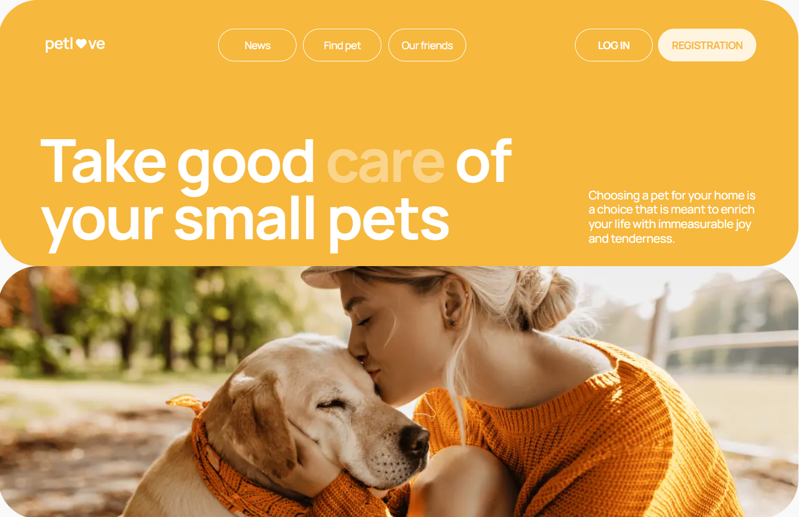

# PetMate-App 🐾 Pet Project

PetMate-App is a lively online platform created to connect pet lovers and promote animal welfare. Whether you're searching for a lost pet or hoping to welcome a new furry companion, PetMate-App is here to support you.

## Key Features ✨

1. User Registration and Login: Users can sign up or log in seamlessly with their email addresses.
2. Animal News and Updates: Stay informed with the latest news and insights from the animal world.
3. Supported Initiatives: Discover animal welfare projects associated with the platform.
4. Pet Discovery: Easily search for pets using filters for categories, gender, price, and location.
5. Sorting Options: Organize search results by price or popularity to streamline your search.
6. Exclusive Features for Registered Users:
   - Detailed Pet Information: Access in-depth details about pets, including contact information and location.
   - Favorites: Save pets to a favorites list for quick access.
   - Profile and Pet Management: Update and manage personal details and information on pets you own.

## Technologies and Tools Used 🛠️

- React
- Redux/Redux-toolkit
- JavaScript
- Api-rest
- Cloudinary-api
- Styled-components
- Material-ui
- Redux-thunk
- Redux-persist
- React-router-dom
- Toastify
- MobileFirst

## General Requirements 📋

The layout should be responsive, except for mobile devices as follows:
- mobile: (from 320px - fluid; from 375px - adaptive)
- tablet: from 768px;
- desktop: from 1280px

It should include:
- adherence to semantics according to HTML5 standards
- fonts connected
- optimized sizes of vector and raster graphics
- ensured support for displaying images for retina screens
- optimized loading of static images
- all icons connected through a sprite
- added display of the page's favicon

### Deployment 🚀

- Versel

### Development Utilities 🧰

- Vite
- VS Code
- Git

## Links 🔗

[Model figma](https://www.figma.com/file/puMNfZVg4YI8UZoJ1QiLLi/Petl%F0%9F%92%9Bve?type=design&node-id=55838-750&mode=design&t=Xg1IwIcKebTl5xGs-0)

[Technical specification](https://docs.google.com/spreadsheets/d/1DmQUeGZy_oaXN6yn69ORLzou1ZQRyTMlrAqPSit_clw/edit?gid=1134921873#gid=1134921873)

[Backend API Documentation](https://petlove.b.goit.study/api-docs/)

## Contributor 👩‍💻

Halyna Marchenko - Developer

- [GitHub](https://github.com/Marchenko1997)
- [LinkedIn](https://www.linkedin.com/in/halyna-marchenko/)